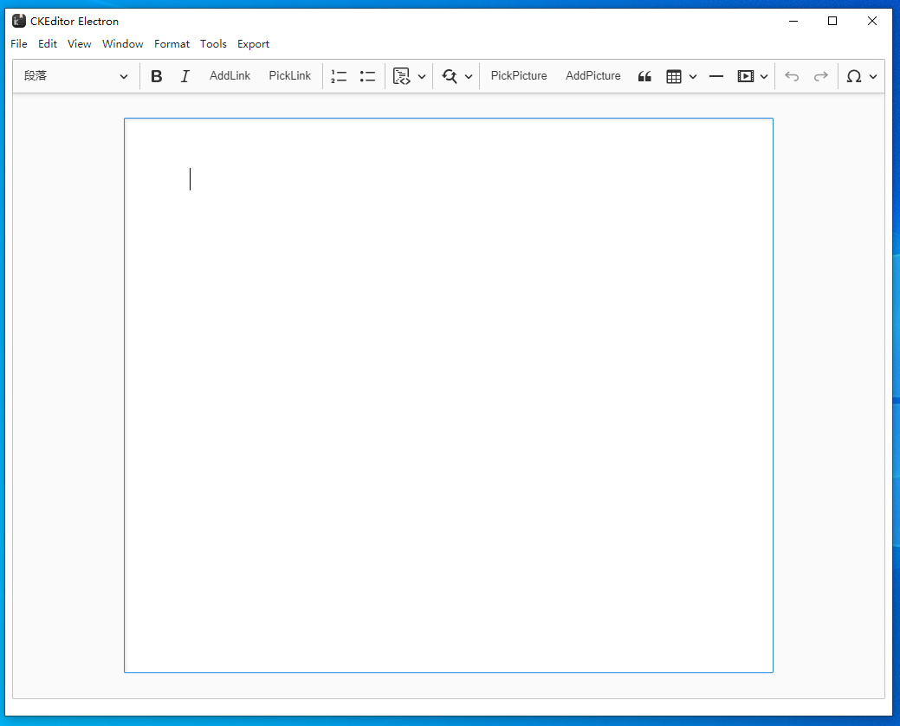

## ckeditor electron (Formerly mark-pad)

A simple constrained-rich-text editor using [Electron](https://www.electronjs.org/), and [CKEditor 5](https://github.com/ckeditor/ckeditor5). Runs on Windows, macOS, Linux, and Chrome OS (via Crostini).

Forked and expanded on from [mingong/tiny-electron](https://github.com/mingong/tiny-electron).

## Screenshot

## Features

*   Open and save files as markdown (MD).
*   View to edit the document as rich-text.
*   Rich-text is constrained. Only headings, bold, italics, To-do lists, strikethrough, bulleted lists, numbered lists, links, block quotes, code, tables, images, and horizontal lines are included. All other styling( e.g. font size, font color, spacing, alignment, etc.) is automatically filtered.
*   Rich-text is displayed with a fixed appearance. Modifiable via stylesheet (or in preferences in the future).
*   Partial support for live conversion of markdown into rich-text in rich-text editing mode. For example, typing `# Header title` will make an H1 header and typing `**This text is bold.**` will give bolded text. This feature does not currently work for links, tables, or images (use the formatting buttons, or keyboard shorcuts instead for these). Also includes live conversions for en (--) and em dashes (---).
*   Editing and formatting keyboard shortcuts in rich-text mode (e.g., ctrl+o = open, ctrl+v = paste, ctrl+t = strikethrough, etc.).
*   Find and replace functionality in the rich-text view.

## Bugs

All the bugs! Editor is experimental and not for production use at this time. Markdown support is especially buggy.

## installation

To install dependencies and run:

`npm install`

`npm start`

To build executables:

`yarn dist`

To install as an application, run the appropriate executable (e.g., .exe, .deb) in the dist folder after building.

## Related

Similar rich-text editors:

*   [Noto Sans Mono CJK TC](https://raw.githubusercontent.com/googlefonts/noto-cjk/main/Sans/Mono/NotoSansMonoCJKtc-Regular.otf)
